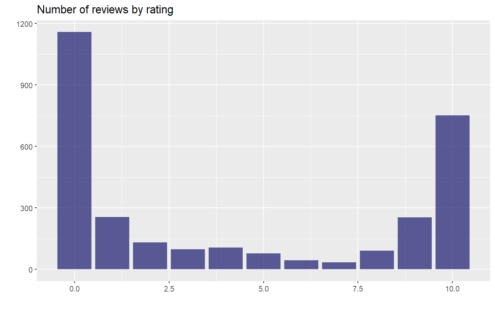
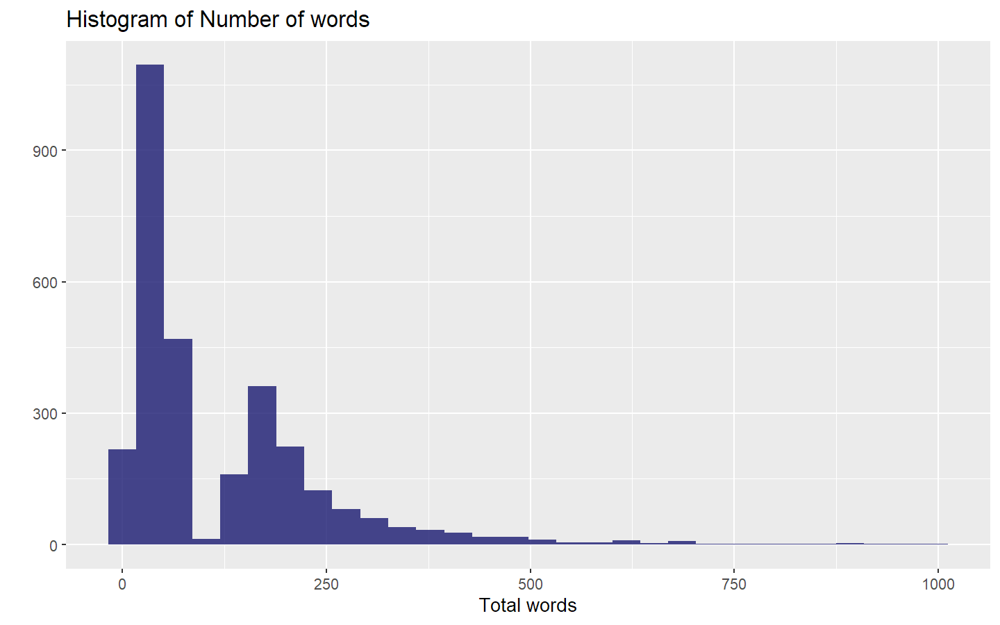
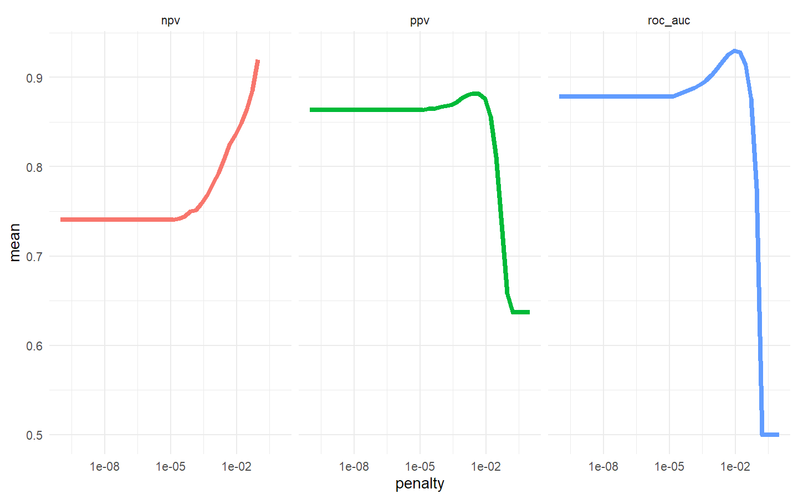
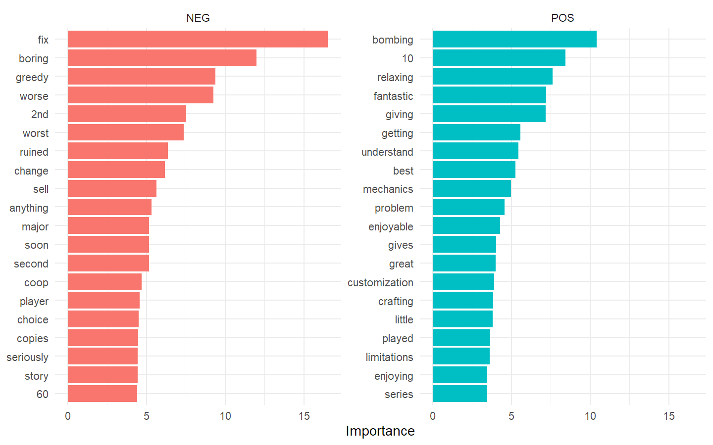

README
================

## “Sentiment Analysis”

### “Julian Avila-Jimenez”

### “16/8/2020”

Build a model for [Animal crossing user reviews
TidyTuesday 2020-05-05](https://github.com/rfordatascience/tidytuesday/blob/master/data/2020/2020-05-05/readme.md)
for predict the rating from the text of the user reviews.

### Get the data and initial exploration.

``` r
user_reviews <- readr::read_tsv('https://raw.githubusercontent.com/rfordatascience/tidytuesday/master/data/2020/2020-05-05/user_reviews.tsv')

head(user_reviews, 15)
```

    ## # A tibble: 15 x 4
    ##    grade user_name     text                                           date      
    ##    <dbl> <chr>         <chr>                                          <date>    
    ##  1     4 mds27272      My gf started playing before me. No option to~ 2020-03-20
    ##  2     5 lolo2178      While the game itself is great, really relaxi~ 2020-03-20
    ##  3     0 Roachant      My wife and I were looking forward to playing~ 2020-03-20
    ##  4     0 Houndf        We need equal values and opportunities for al~ 2020-03-20
    ##  5     0 ProfessorFox  BEWARE!  If you have multiple people in your ~ 2020-03-20
    ##  6     0 tb726         The limitation of one island per Switch (not ~ 2020-03-20
    ##  7     0 Outryder86    I was very excited for this new installment o~ 2020-03-20
    ##  8     0 Subby89       It's 2020 and for some reason Nintendo has de~ 2020-03-20
    ##  9     0 RocketRon     This is so annoying. Only one player has the ~ 2020-03-20
    ## 10     0 chankills     I purchased this game for my household (me an~ 2020-03-20
    ## 11     1 rafilks182    they heavily marketed this game as a social e~ 2020-03-20
    ## 12     0 Gravy_Dreamb~ You can only have one island per Switch. If m~ 2020-03-20
    ## 13     0 Lazariel      Only ONE island per console!You can't create ~ 2020-03-20
    ## 14     0 novaaaa       You can only create one island per switch and~ 2020-03-20
    ## 15     0 sooners11     One island per console is a pretty terrible a~ 2020-03-20

``` r
user_reviews %>%
  count(grade) %>%
  ggplot(aes(grade, n)) +
  geom_col(fill = "midnightblue", alpha = 0.7)+
  labs(x="", y="",
       title="Number of reviews by rating")
```

<!-- -->

We can see that lots of people give extreme scores in their rewiews,
this distribution is nor suitable to make a prediction model so its a
good idea to convert this scores to a label and build a model of binary
clasification good vs. bad user reviews.

  - Explore the structure of the “good” reviews.

<!-- end list -->

``` r
user_reviews %>%
  filter(grade > 8) %>%
  sample_n(5) %>%
  pull(text)
```

    ## [1] "This game makes me wanna throw up. 5 stars10 out of 10Love itFishing hardMake me wanna throw up"                                                                                                 
    ## [2] "This is my first Animal Crossing game, but I absolutely love it! Finally get the hype! It's exac6the sort of stress-free distraction we all need right now."                                     
    ## [3] "Great game. People need to quit being children and review bombing it. Its completely ridiculous to review bomb something over a 1 island per profile limit it doesnt mean they wont add more...."
    ## [4] "Es impresionante lo divertido que es, las horas se pasan volando. Cada detalle es perfecto, para mí es el juego del año."                                                                        
    ## [5] "This is the best game in the Animal Crossing series. I would actually give it a 9/10, because it isn't perfect, but I need to balance out all these negative reviews."

The reviews have some text problems, Let’s remove at least the final
*“Expand”* from the reviews, and create a new categorical `rating`
variable.

``` r
reviews_parsed <- user_reviews %>%
  mutate(text = str_remove(text, "Expand$")) %>% #remove the word Expand
  mutate(rating = case_when(
    grade > 7 ~ "good", #make a new variable rating, treshold in 7
    TRUE ~ "bad"
  ))
```

Now let’s prepare the reviews to make the model, for this we split the
`text` column into tokens by user name.

``` r
library(tidytext)

words_per_review <- reviews_parsed %>%
  unnest_tokens(word, text) %>%
  count(user_name, name = "total_words")

words_per_review %>%
  ggplot(aes(total_words)) +
  geom_histogram(fill = "midnightblue", alpha = 0.8)+
  labs(y="", x= "Total words",
       title= "Histogram of Number of words")
```

<!-- -->

This distribution of words is not natural, the gap in the midle of the
distribution looks very strange and maybe is related to the data
adquisition procedure. But the data is never perfect…

-----

### Let’s build a model

  - Split the data into training and test datasets

<!-- end list -->

``` r
library(tidymodels)

set.seed(123)
review_split <- initial_split(reviews_parsed, strata = rating)
review_train <- training(review_split)
review_test <- testing(review_split)
```

  - Preprocess the data

<!-- end list -->

``` r
library(textrecipes)

review_rec <- recipe(rating ~ text, data = review_train) %>% #make the recipe
  step_tokenize(text) %>% #tokenixe text 
  step_stopwords(text) %>% #remove stopwords
  step_tokenfilter(text, max_tokens = 500) %>% #filter tokens by frecuency, keep the top 500 most-used tokens
  step_tfidf(text) %>% #create a Inverted document frecuency. common or rare the word is across all the observations
  step_normalize(all_predictors()) #Center and scale numeric data

review_prep <- prep(review_rec) #The prep() function is where everything gets evaluated

review_prep
```

    ## Data Recipe
    ## 
    ## Inputs:
    ## 
    ##       role #variables
    ##    outcome          1
    ##  predictor          1
    ## 
    ## Training data contained 2250 data points and no missing data.
    ## 
    ## Operations:
    ## 
    ## Tokenization for text [trained]
    ## Stop word removal for text [trained]
    ## Text filtering for text [trained]
    ## Term frequency-inverse document frequency with text [trained]
    ## Centering and scaling for tfidf_text_0, tfidf_text_1, ... [trained]

  - Specify the model. Here we can set up the model specification for
    lasso regression with `penalty = tune()` since we don’t yet know the
    best value for the regularization parameter and `mixture = 1` for
    lasso. The lasso has proved to be a good baseline for text modeling.

<!-- end list -->

``` r
lasso_spec <- logistic_reg(penalty = tune(), mixture = 1) %>%
  set_engine("glmnet")

lasso_wf <- workflow() %>% #use the workflow to manage modeling pipelines more easily
  add_recipe(review_rec) %>%
  add_model(lasso_spec)

lasso_wf
```

    ## == Workflow ==================================================
    ## Preprocessor: Recipe
    ## Model: logistic_reg()
    ## 
    ## -- Preprocessor ----------------------------------------------
    ## 5 Recipe Steps
    ## 
    ## * step_tokenize()
    ## * step_stopwords()
    ## * step_tokenfilter()
    ## * step_tfidf()
    ## * step_normalize()
    ## 
    ## -- Model -----------------------------------------------------
    ## Logistic Regression Model Specification (classification)
    ## 
    ## Main Arguments:
    ##   penalty = tune()
    ##   mixture = 1
    ## 
    ## Computational engine: glmnet

  - Tune model parameters.

First, we need a set of possible regularization parameters to try.

``` r
lambda_grid <- grid_regular(penalty(), levels = 40) 
```

Next, we need a set of resampled data to fit and evaluate all these
models.

``` r
set.seed(123)
review_folds <- bootstraps(review_train, strata = rating)
review_folds
```

    ## # Bootstrap sampling using stratification 
    ## # A tibble: 25 x 2
    ##    splits             id         
    ##    <list>             <chr>      
    ##  1 <split [2.2K/812]> Bootstrap01
    ##  2 <split [2.2K/850]> Bootstrap02
    ##  3 <split [2.2K/814]> Bootstrap03
    ##  4 <split [2.2K/814]> Bootstrap04
    ##  5 <split [2.2K/853]> Bootstrap05
    ##  6 <split [2.2K/840]> Bootstrap06
    ##  7 <split [2.2K/816]> Bootstrap07
    ##  8 <split [2.2K/826]> Bootstrap08
    ##  9 <split [2.2K/804]> Bootstrap09
    ## 10 <split [2.2K/809]> Bootstrap10
    ## # ... with 15 more rows

Implement the tunning

``` r
set.seed(2020)
lasso_grid <- tune_grid(lasso_wf,
                        resamples = review_folds,
                        grid = lambda_grid,
                        metrics = metric_set(roc_auc, ppv, npv) #set the metrics to compute
)
```

Once we have our tuning results, we can examine them in detail.

``` r
lasso_grid %>%
  collect_metrics() %>% 
  kable() %>% 
  kable_styling(bootstrap_options = "striped", 
                full_width = F, 
                position = "left")%>%
  scroll_box(height = "200px")
```

<div style="border: 1px solid #ddd; padding: 0px; overflow-y: scroll; height:200px; ">

<table class="table table-striped" style="width: auto !important; ">

<thead>

<tr>

<th style="text-align:right;position: sticky; top:0; background-color: #FFFFFF;">

penalty

</th>

<th style="text-align:left;position: sticky; top:0; background-color: #FFFFFF;">

.metric

</th>

<th style="text-align:left;position: sticky; top:0; background-color: #FFFFFF;">

.estimator

</th>

<th style="text-align:right;position: sticky; top:0; background-color: #FFFFFF;">

mean

</th>

<th style="text-align:right;position: sticky; top:0; background-color: #FFFFFF;">

n

</th>

<th style="text-align:right;position: sticky; top:0; background-color: #FFFFFF;">

std\_err

</th>

<th style="text-align:left;position: sticky; top:0; background-color: #FFFFFF;">

.config

</th>

</tr>

</thead>

<tbody>

<tr>

<td style="text-align:right;">

0.0000000

</td>

<td style="text-align:left;">

npv

</td>

<td style="text-align:left;">

binary

</td>

<td style="text-align:right;">

0.7404002

</td>

<td style="text-align:right;">

25

</td>

<td style="text-align:right;">

0.0051755

</td>

<td style="text-align:left;">

Model01

</td>

</tr>

<tr>

<td style="text-align:right;">

0.0000000

</td>

<td style="text-align:left;">

ppv

</td>

<td style="text-align:left;">

binary

</td>

<td style="text-align:right;">

0.8635544

</td>

<td style="text-align:right;">

25

</td>

<td style="text-align:right;">

0.0030250

</td>

<td style="text-align:left;">

Model01

</td>

</tr>

<tr>

<td style="text-align:right;">

0.0000000

</td>

<td style="text-align:left;">

roc\_auc

</td>

<td style="text-align:left;">

binary

</td>

<td style="text-align:right;">

0.8784799

</td>

<td style="text-align:right;">

25

</td>

<td style="text-align:right;">

0.0027573

</td>

<td style="text-align:left;">

Model01

</td>

</tr>

<tr>

<td style="text-align:right;">

0.0000000

</td>

<td style="text-align:left;">

npv

</td>

<td style="text-align:left;">

binary

</td>

<td style="text-align:right;">

0.7404002

</td>

<td style="text-align:right;">

25

</td>

<td style="text-align:right;">

0.0051755

</td>

<td style="text-align:left;">

Model02

</td>

</tr>

<tr>

<td style="text-align:right;">

0.0000000

</td>

<td style="text-align:left;">

ppv

</td>

<td style="text-align:left;">

binary

</td>

<td style="text-align:right;">

0.8635544

</td>

<td style="text-align:right;">

25

</td>

<td style="text-align:right;">

0.0030250

</td>

<td style="text-align:left;">

Model02

</td>

</tr>

<tr>

<td style="text-align:right;">

0.0000000

</td>

<td style="text-align:left;">

roc\_auc

</td>

<td style="text-align:left;">

binary

</td>

<td style="text-align:right;">

0.8784799

</td>

<td style="text-align:right;">

25

</td>

<td style="text-align:right;">

0.0027573

</td>

<td style="text-align:left;">

Model02

</td>

</tr>

<tr>

<td style="text-align:right;">

0.0000000

</td>

<td style="text-align:left;">

npv

</td>

<td style="text-align:left;">

binary

</td>

<td style="text-align:right;">

0.7404002

</td>

<td style="text-align:right;">

25

</td>

<td style="text-align:right;">

0.0051755

</td>

<td style="text-align:left;">

Model03

</td>

</tr>

<tr>

<td style="text-align:right;">

0.0000000

</td>

<td style="text-align:left;">

ppv

</td>

<td style="text-align:left;">

binary

</td>

<td style="text-align:right;">

0.8635544

</td>

<td style="text-align:right;">

25

</td>

<td style="text-align:right;">

0.0030250

</td>

<td style="text-align:left;">

Model03

</td>

</tr>

<tr>

<td style="text-align:right;">

0.0000000

</td>

<td style="text-align:left;">

roc\_auc

</td>

<td style="text-align:left;">

binary

</td>

<td style="text-align:right;">

0.8784799

</td>

<td style="text-align:right;">

25

</td>

<td style="text-align:right;">

0.0027573

</td>

<td style="text-align:left;">

Model03

</td>

</tr>

<tr>

<td style="text-align:right;">

0.0000000

</td>

<td style="text-align:left;">

npv

</td>

<td style="text-align:left;">

binary

</td>

<td style="text-align:right;">

0.7404002

</td>

<td style="text-align:right;">

25

</td>

<td style="text-align:right;">

0.0051755

</td>

<td style="text-align:left;">

Model04

</td>

</tr>

<tr>

<td style="text-align:right;">

0.0000000

</td>

<td style="text-align:left;">

ppv

</td>

<td style="text-align:left;">

binary

</td>

<td style="text-align:right;">

0.8635544

</td>

<td style="text-align:right;">

25

</td>

<td style="text-align:right;">

0.0030250

</td>

<td style="text-align:left;">

Model04

</td>

</tr>

<tr>

<td style="text-align:right;">

0.0000000

</td>

<td style="text-align:left;">

roc\_auc

</td>

<td style="text-align:left;">

binary

</td>

<td style="text-align:right;">

0.8784799

</td>

<td style="text-align:right;">

25

</td>

<td style="text-align:right;">

0.0027573

</td>

<td style="text-align:left;">

Model04

</td>

</tr>

<tr>

<td style="text-align:right;">

0.0000000

</td>

<td style="text-align:left;">

npv

</td>

<td style="text-align:left;">

binary

</td>

<td style="text-align:right;">

0.7404002

</td>

<td style="text-align:right;">

25

</td>

<td style="text-align:right;">

0.0051755

</td>

<td style="text-align:left;">

Model05

</td>

</tr>

<tr>

<td style="text-align:right;">

0.0000000

</td>

<td style="text-align:left;">

ppv

</td>

<td style="text-align:left;">

binary

</td>

<td style="text-align:right;">

0.8635544

</td>

<td style="text-align:right;">

25

</td>

<td style="text-align:right;">

0.0030250

</td>

<td style="text-align:left;">

Model05

</td>

</tr>

<tr>

<td style="text-align:right;">

0.0000000

</td>

<td style="text-align:left;">

roc\_auc

</td>

<td style="text-align:left;">

binary

</td>

<td style="text-align:right;">

0.8784799

</td>

<td style="text-align:right;">

25

</td>

<td style="text-align:right;">

0.0027573

</td>

<td style="text-align:left;">

Model05

</td>

</tr>

<tr>

<td style="text-align:right;">

0.0000000

</td>

<td style="text-align:left;">

npv

</td>

<td style="text-align:left;">

binary

</td>

<td style="text-align:right;">

0.7404002

</td>

<td style="text-align:right;">

25

</td>

<td style="text-align:right;">

0.0051755

</td>

<td style="text-align:left;">

Model06

</td>

</tr>

<tr>

<td style="text-align:right;">

0.0000000

</td>

<td style="text-align:left;">

ppv

</td>

<td style="text-align:left;">

binary

</td>

<td style="text-align:right;">

0.8635544

</td>

<td style="text-align:right;">

25

</td>

<td style="text-align:right;">

0.0030250

</td>

<td style="text-align:left;">

Model06

</td>

</tr>

<tr>

<td style="text-align:right;">

0.0000000

</td>

<td style="text-align:left;">

roc\_auc

</td>

<td style="text-align:left;">

binary

</td>

<td style="text-align:right;">

0.8784799

</td>

<td style="text-align:right;">

25

</td>

<td style="text-align:right;">

0.0027573

</td>

<td style="text-align:left;">

Model06

</td>

</tr>

<tr>

<td style="text-align:right;">

0.0000000

</td>

<td style="text-align:left;">

npv

</td>

<td style="text-align:left;">

binary

</td>

<td style="text-align:right;">

0.7404002

</td>

<td style="text-align:right;">

25

</td>

<td style="text-align:right;">

0.0051755

</td>

<td style="text-align:left;">

Model07

</td>

</tr>

<tr>

<td style="text-align:right;">

0.0000000

</td>

<td style="text-align:left;">

ppv

</td>

<td style="text-align:left;">

binary

</td>

<td style="text-align:right;">

0.8635544

</td>

<td style="text-align:right;">

25

</td>

<td style="text-align:right;">

0.0030250

</td>

<td style="text-align:left;">

Model07

</td>

</tr>

<tr>

<td style="text-align:right;">

0.0000000

</td>

<td style="text-align:left;">

roc\_auc

</td>

<td style="text-align:left;">

binary

</td>

<td style="text-align:right;">

0.8784799

</td>

<td style="text-align:right;">

25

</td>

<td style="text-align:right;">

0.0027573

</td>

<td style="text-align:left;">

Model07

</td>

</tr>

<tr>

<td style="text-align:right;">

0.0000000

</td>

<td style="text-align:left;">

npv

</td>

<td style="text-align:left;">

binary

</td>

<td style="text-align:right;">

0.7404002

</td>

<td style="text-align:right;">

25

</td>

<td style="text-align:right;">

0.0051755

</td>

<td style="text-align:left;">

Model08

</td>

</tr>

<tr>

<td style="text-align:right;">

0.0000000

</td>

<td style="text-align:left;">

ppv

</td>

<td style="text-align:left;">

binary

</td>

<td style="text-align:right;">

0.8635544

</td>

<td style="text-align:right;">

25

</td>

<td style="text-align:right;">

0.0030250

</td>

<td style="text-align:left;">

Model08

</td>

</tr>

<tr>

<td style="text-align:right;">

0.0000000

</td>

<td style="text-align:left;">

roc\_auc

</td>

<td style="text-align:left;">

binary

</td>

<td style="text-align:right;">

0.8784799

</td>

<td style="text-align:right;">

25

</td>

<td style="text-align:right;">

0.0027573

</td>

<td style="text-align:left;">

Model08

</td>

</tr>

<tr>

<td style="text-align:right;">

0.0000000

</td>

<td style="text-align:left;">

npv

</td>

<td style="text-align:left;">

binary

</td>

<td style="text-align:right;">

0.7404002

</td>

<td style="text-align:right;">

25

</td>

<td style="text-align:right;">

0.0051755

</td>

<td style="text-align:left;">

Model09

</td>

</tr>

<tr>

<td style="text-align:right;">

0.0000000

</td>

<td style="text-align:left;">

ppv

</td>

<td style="text-align:left;">

binary

</td>

<td style="text-align:right;">

0.8635544

</td>

<td style="text-align:right;">

25

</td>

<td style="text-align:right;">

0.0030250

</td>

<td style="text-align:left;">

Model09

</td>

</tr>

<tr>

<td style="text-align:right;">

0.0000000

</td>

<td style="text-align:left;">

roc\_auc

</td>

<td style="text-align:left;">

binary

</td>

<td style="text-align:right;">

0.8784799

</td>

<td style="text-align:right;">

25

</td>

<td style="text-align:right;">

0.0027573

</td>

<td style="text-align:left;">

Model09

</td>

</tr>

<tr>

<td style="text-align:right;">

0.0000000

</td>

<td style="text-align:left;">

npv

</td>

<td style="text-align:left;">

binary

</td>

<td style="text-align:right;">

0.7404002

</td>

<td style="text-align:right;">

25

</td>

<td style="text-align:right;">

0.0051755

</td>

<td style="text-align:left;">

Model10

</td>

</tr>

<tr>

<td style="text-align:right;">

0.0000000

</td>

<td style="text-align:left;">

ppv

</td>

<td style="text-align:left;">

binary

</td>

<td style="text-align:right;">

0.8635544

</td>

<td style="text-align:right;">

25

</td>

<td style="text-align:right;">

0.0030250

</td>

<td style="text-align:left;">

Model10

</td>

</tr>

<tr>

<td style="text-align:right;">

0.0000000

</td>

<td style="text-align:left;">

roc\_auc

</td>

<td style="text-align:left;">

binary

</td>

<td style="text-align:right;">

0.8784799

</td>

<td style="text-align:right;">

25

</td>

<td style="text-align:right;">

0.0027573

</td>

<td style="text-align:left;">

Model10

</td>

</tr>

<tr>

<td style="text-align:right;">

0.0000000

</td>

<td style="text-align:left;">

npv

</td>

<td style="text-align:left;">

binary

</td>

<td style="text-align:right;">

0.7404002

</td>

<td style="text-align:right;">

25

</td>

<td style="text-align:right;">

0.0051755

</td>

<td style="text-align:left;">

Model11

</td>

</tr>

<tr>

<td style="text-align:right;">

0.0000000

</td>

<td style="text-align:left;">

ppv

</td>

<td style="text-align:left;">

binary

</td>

<td style="text-align:right;">

0.8635544

</td>

<td style="text-align:right;">

25

</td>

<td style="text-align:right;">

0.0030250

</td>

<td style="text-align:left;">

Model11

</td>

</tr>

<tr>

<td style="text-align:right;">

0.0000000

</td>

<td style="text-align:left;">

roc\_auc

</td>

<td style="text-align:left;">

binary

</td>

<td style="text-align:right;">

0.8784799

</td>

<td style="text-align:right;">

25

</td>

<td style="text-align:right;">

0.0027573

</td>

<td style="text-align:left;">

Model11

</td>

</tr>

<tr>

<td style="text-align:right;">

0.0000001

</td>

<td style="text-align:left;">

npv

</td>

<td style="text-align:left;">

binary

</td>

<td style="text-align:right;">

0.7404002

</td>

<td style="text-align:right;">

25

</td>

<td style="text-align:right;">

0.0051755

</td>

<td style="text-align:left;">

Model12

</td>

</tr>

<tr>

<td style="text-align:right;">

0.0000001

</td>

<td style="text-align:left;">

ppv

</td>

<td style="text-align:left;">

binary

</td>

<td style="text-align:right;">

0.8635544

</td>

<td style="text-align:right;">

25

</td>

<td style="text-align:right;">

0.0030250

</td>

<td style="text-align:left;">

Model12

</td>

</tr>

<tr>

<td style="text-align:right;">

0.0000001

</td>

<td style="text-align:left;">

roc\_auc

</td>

<td style="text-align:left;">

binary

</td>

<td style="text-align:right;">

0.8784799

</td>

<td style="text-align:right;">

25

</td>

<td style="text-align:right;">

0.0027573

</td>

<td style="text-align:left;">

Model12

</td>

</tr>

<tr>

<td style="text-align:right;">

0.0000001

</td>

<td style="text-align:left;">

npv

</td>

<td style="text-align:left;">

binary

</td>

<td style="text-align:right;">

0.7404002

</td>

<td style="text-align:right;">

25

</td>

<td style="text-align:right;">

0.0051755

</td>

<td style="text-align:left;">

Model13

</td>

</tr>

<tr>

<td style="text-align:right;">

0.0000001

</td>

<td style="text-align:left;">

ppv

</td>

<td style="text-align:left;">

binary

</td>

<td style="text-align:right;">

0.8635544

</td>

<td style="text-align:right;">

25

</td>

<td style="text-align:right;">

0.0030250

</td>

<td style="text-align:left;">

Model13

</td>

</tr>

<tr>

<td style="text-align:right;">

0.0000001

</td>

<td style="text-align:left;">

roc\_auc

</td>

<td style="text-align:left;">

binary

</td>

<td style="text-align:right;">

0.8784799

</td>

<td style="text-align:right;">

25

</td>

<td style="text-align:right;">

0.0027573

</td>

<td style="text-align:left;">

Model13

</td>

</tr>

<tr>

<td style="text-align:right;">

0.0000002

</td>

<td style="text-align:left;">

npv

</td>

<td style="text-align:left;">

binary

</td>

<td style="text-align:right;">

0.7404002

</td>

<td style="text-align:right;">

25

</td>

<td style="text-align:right;">

0.0051755

</td>

<td style="text-align:left;">

Model14

</td>

</tr>

<tr>

<td style="text-align:right;">

0.0000002

</td>

<td style="text-align:left;">

ppv

</td>

<td style="text-align:left;">

binary

</td>

<td style="text-align:right;">

0.8635544

</td>

<td style="text-align:right;">

25

</td>

<td style="text-align:right;">

0.0030250

</td>

<td style="text-align:left;">

Model14

</td>

</tr>

<tr>

<td style="text-align:right;">

0.0000002

</td>

<td style="text-align:left;">

roc\_auc

</td>

<td style="text-align:left;">

binary

</td>

<td style="text-align:right;">

0.8784799

</td>

<td style="text-align:right;">

25

</td>

<td style="text-align:right;">

0.0027573

</td>

<td style="text-align:left;">

Model14

</td>

</tr>

<tr>

<td style="text-align:right;">

0.0000004

</td>

<td style="text-align:left;">

npv

</td>

<td style="text-align:left;">

binary

</td>

<td style="text-align:right;">

0.7404002

</td>

<td style="text-align:right;">

25

</td>

<td style="text-align:right;">

0.0051755

</td>

<td style="text-align:left;">

Model15

</td>

</tr>

<tr>

<td style="text-align:right;">

0.0000004

</td>

<td style="text-align:left;">

ppv

</td>

<td style="text-align:left;">

binary

</td>

<td style="text-align:right;">

0.8635544

</td>

<td style="text-align:right;">

25

</td>

<td style="text-align:right;">

0.0030250

</td>

<td style="text-align:left;">

Model15

</td>

</tr>

<tr>

<td style="text-align:right;">

0.0000004

</td>

<td style="text-align:left;">

roc\_auc

</td>

<td style="text-align:left;">

binary

</td>

<td style="text-align:right;">

0.8784799

</td>

<td style="text-align:right;">

25

</td>

<td style="text-align:right;">

0.0027573

</td>

<td style="text-align:left;">

Model15

</td>

</tr>

<tr>

<td style="text-align:right;">

0.0000007

</td>

<td style="text-align:left;">

npv

</td>

<td style="text-align:left;">

binary

</td>

<td style="text-align:right;">

0.7404002

</td>

<td style="text-align:right;">

25

</td>

<td style="text-align:right;">

0.0051755

</td>

<td style="text-align:left;">

Model16

</td>

</tr>

<tr>

<td style="text-align:right;">

0.0000007

</td>

<td style="text-align:left;">

ppv

</td>

<td style="text-align:left;">

binary

</td>

<td style="text-align:right;">

0.8635544

</td>

<td style="text-align:right;">

25

</td>

<td style="text-align:right;">

0.0030250

</td>

<td style="text-align:left;">

Model16

</td>

</tr>

<tr>

<td style="text-align:right;">

0.0000007

</td>

<td style="text-align:left;">

roc\_auc

</td>

<td style="text-align:left;">

binary

</td>

<td style="text-align:right;">

0.8784799

</td>

<td style="text-align:right;">

25

</td>

<td style="text-align:right;">

0.0027573

</td>

<td style="text-align:left;">

Model16

</td>

</tr>

<tr>

<td style="text-align:right;">

0.0000013

</td>

<td style="text-align:left;">

npv

</td>

<td style="text-align:left;">

binary

</td>

<td style="text-align:right;">

0.7404002

</td>

<td style="text-align:right;">

25

</td>

<td style="text-align:right;">

0.0051755

</td>

<td style="text-align:left;">

Model17

</td>

</tr>

<tr>

<td style="text-align:right;">

0.0000013

</td>

<td style="text-align:left;">

ppv

</td>

<td style="text-align:left;">

binary

</td>

<td style="text-align:right;">

0.8635544

</td>

<td style="text-align:right;">

25

</td>

<td style="text-align:right;">

0.0030250

</td>

<td style="text-align:left;">

Model17

</td>

</tr>

<tr>

<td style="text-align:right;">

0.0000013

</td>

<td style="text-align:left;">

roc\_auc

</td>

<td style="text-align:left;">

binary

</td>

<td style="text-align:right;">

0.8784799

</td>

<td style="text-align:right;">

25

</td>

<td style="text-align:right;">

0.0027573

</td>

<td style="text-align:left;">

Model17

</td>

</tr>

<tr>

<td style="text-align:right;">

0.0000023

</td>

<td style="text-align:left;">

npv

</td>

<td style="text-align:left;">

binary

</td>

<td style="text-align:right;">

0.7404002

</td>

<td style="text-align:right;">

25

</td>

<td style="text-align:right;">

0.0051755

</td>

<td style="text-align:left;">

Model18

</td>

</tr>

<tr>

<td style="text-align:right;">

0.0000023

</td>

<td style="text-align:left;">

ppv

</td>

<td style="text-align:left;">

binary

</td>

<td style="text-align:right;">

0.8635544

</td>

<td style="text-align:right;">

25

</td>

<td style="text-align:right;">

0.0030250

</td>

<td style="text-align:left;">

Model18

</td>

</tr>

<tr>

<td style="text-align:right;">

0.0000023

</td>

<td style="text-align:left;">

roc\_auc

</td>

<td style="text-align:left;">

binary

</td>

<td style="text-align:right;">

0.8784799

</td>

<td style="text-align:right;">

25

</td>

<td style="text-align:right;">

0.0027573

</td>

<td style="text-align:left;">

Model18

</td>

</tr>

<tr>

<td style="text-align:right;">

0.0000041

</td>

<td style="text-align:left;">

npv

</td>

<td style="text-align:left;">

binary

</td>

<td style="text-align:right;">

0.7404002

</td>

<td style="text-align:right;">

25

</td>

<td style="text-align:right;">

0.0051755

</td>

<td style="text-align:left;">

Model19

</td>

</tr>

<tr>

<td style="text-align:right;">

0.0000041

</td>

<td style="text-align:left;">

ppv

</td>

<td style="text-align:left;">

binary

</td>

<td style="text-align:right;">

0.8635544

</td>

<td style="text-align:right;">

25

</td>

<td style="text-align:right;">

0.0030250

</td>

<td style="text-align:left;">

Model19

</td>

</tr>

<tr>

<td style="text-align:right;">

0.0000041

</td>

<td style="text-align:left;">

roc\_auc

</td>

<td style="text-align:left;">

binary

</td>

<td style="text-align:right;">

0.8784799

</td>

<td style="text-align:right;">

25

</td>

<td style="text-align:right;">

0.0027573

</td>

<td style="text-align:left;">

Model19

</td>

</tr>

<tr>

<td style="text-align:right;">

0.0000074

</td>

<td style="text-align:left;">

npv

</td>

<td style="text-align:left;">

binary

</td>

<td style="text-align:right;">

0.7404002

</td>

<td style="text-align:right;">

25

</td>

<td style="text-align:right;">

0.0051755

</td>

<td style="text-align:left;">

Model20

</td>

</tr>

<tr>

<td style="text-align:right;">

0.0000074

</td>

<td style="text-align:left;">

ppv

</td>

<td style="text-align:left;">

binary

</td>

<td style="text-align:right;">

0.8635544

</td>

<td style="text-align:right;">

25

</td>

<td style="text-align:right;">

0.0030250

</td>

<td style="text-align:left;">

Model20

</td>

</tr>

<tr>

<td style="text-align:right;">

0.0000074

</td>

<td style="text-align:left;">

roc\_auc

</td>

<td style="text-align:left;">

binary

</td>

<td style="text-align:right;">

0.8784799

</td>

<td style="text-align:right;">

25

</td>

<td style="text-align:right;">

0.0027573

</td>

<td style="text-align:left;">

Model20

</td>

</tr>

<tr>

<td style="text-align:right;">

0.0000134

</td>

<td style="text-align:left;">

npv

</td>

<td style="text-align:left;">

binary

</td>

<td style="text-align:right;">

0.7403643

</td>

<td style="text-align:right;">

25

</td>

<td style="text-align:right;">

0.0051784

</td>

<td style="text-align:left;">

Model21

</td>

</tr>

<tr>

<td style="text-align:right;">

0.0000134

</td>

<td style="text-align:left;">

ppv

</td>

<td style="text-align:left;">

binary

</td>

<td style="text-align:right;">

0.8634938

</td>

<td style="text-align:right;">

25

</td>

<td style="text-align:right;">

0.0030462

</td>

<td style="text-align:left;">

Model21

</td>

</tr>

<tr>

<td style="text-align:right;">

0.0000134

</td>

<td style="text-align:left;">

roc\_auc

</td>

<td style="text-align:left;">

binary

</td>

<td style="text-align:right;">

0.8785062

</td>

<td style="text-align:right;">

25

</td>

<td style="text-align:right;">

0.0027564

</td>

<td style="text-align:left;">

Model21

</td>

</tr>

<tr>

<td style="text-align:right;">

0.0000242

</td>

<td style="text-align:left;">

npv

</td>

<td style="text-align:left;">

binary

</td>

<td style="text-align:right;">

0.7421082

</td>

<td style="text-align:right;">

25

</td>

<td style="text-align:right;">

0.0051740

</td>

<td style="text-align:left;">

Model22

</td>

</tr>

<tr>

<td style="text-align:right;">

0.0000242

</td>

<td style="text-align:left;">

ppv

</td>

<td style="text-align:left;">

binary

</td>

<td style="text-align:right;">

0.8644417

</td>

<td style="text-align:right;">

25

</td>

<td style="text-align:right;">

0.0029595

</td>

<td style="text-align:left;">

Model22

</td>

</tr>

<tr>

<td style="text-align:right;">

0.0000242

</td>

<td style="text-align:left;">

roc\_auc

</td>

<td style="text-align:left;">

binary

</td>

<td style="text-align:right;">

0.8807108

</td>

<td style="text-align:right;">

25

</td>

<td style="text-align:right;">

0.0025899

</td>

<td style="text-align:left;">

Model22

</td>

</tr>

<tr>

<td style="text-align:right;">

0.0000438

</td>

<td style="text-align:left;">

npv

</td>

<td style="text-align:left;">

binary

</td>

<td style="text-align:right;">

0.7441448

</td>

<td style="text-align:right;">

25

</td>

<td style="text-align:right;">

0.0049054

</td>

<td style="text-align:left;">

Model23

</td>

</tr>

<tr>

<td style="text-align:right;">

0.0000438

</td>

<td style="text-align:left;">

ppv

</td>

<td style="text-align:left;">

binary

</td>

<td style="text-align:right;">

0.8648689

</td>

<td style="text-align:right;">

25

</td>

<td style="text-align:right;">

0.0029972

</td>

<td style="text-align:left;">

Model23

</td>

</tr>

<tr>

<td style="text-align:right;">

0.0000438

</td>

<td style="text-align:left;">

roc\_auc

</td>

<td style="text-align:left;">

binary

</td>

<td style="text-align:right;">

0.8831642

</td>

<td style="text-align:right;">

25

</td>

<td style="text-align:right;">

0.0025112

</td>

<td style="text-align:left;">

Model23

</td>

</tr>

<tr>

<td style="text-align:right;">

0.0000790

</td>

<td style="text-align:left;">

npv

</td>

<td style="text-align:left;">

binary

</td>

<td style="text-align:right;">

0.7496878

</td>

<td style="text-align:right;">

25

</td>

<td style="text-align:right;">

0.0049223

</td>

<td style="text-align:left;">

Model24

</td>

</tr>

<tr>

<td style="text-align:right;">

0.0000790

</td>

<td style="text-align:left;">

ppv

</td>

<td style="text-align:left;">

binary

</td>

<td style="text-align:right;">

0.8666593

</td>

<td style="text-align:right;">

25

</td>

<td style="text-align:right;">

0.0027715

</td>

<td style="text-align:left;">

Model24

</td>

</tr>

<tr>

<td style="text-align:right;">

0.0000790

</td>

<td style="text-align:left;">

roc\_auc

</td>

<td style="text-align:left;">

binary

</td>

<td style="text-align:right;">

0.8857648

</td>

<td style="text-align:right;">

25

</td>

<td style="text-align:right;">

0.0023844

</td>

<td style="text-align:left;">

Model24

</td>

</tr>

<tr>

<td style="text-align:right;">

0.0001425

</td>

<td style="text-align:left;">

npv

</td>

<td style="text-align:left;">

binary

</td>

<td style="text-align:right;">

0.7515045

</td>

<td style="text-align:right;">

25

</td>

<td style="text-align:right;">

0.0048764

</td>

<td style="text-align:left;">

Model25

</td>

</tr>

<tr>

<td style="text-align:right;">

0.0001425

</td>

<td style="text-align:left;">

ppv

</td>

<td style="text-align:left;">

binary

</td>

<td style="text-align:right;">

0.8675778

</td>

<td style="text-align:right;">

25

</td>

<td style="text-align:right;">

0.0029213

</td>

<td style="text-align:left;">

Model25

</td>

</tr>

<tr>

<td style="text-align:right;">

0.0001425

</td>

<td style="text-align:left;">

roc\_auc

</td>

<td style="text-align:left;">

binary

</td>

<td style="text-align:right;">

0.8885057

</td>

<td style="text-align:right;">

25

</td>

<td style="text-align:right;">

0.0022577

</td>

<td style="text-align:left;">

Model25

</td>

</tr>

<tr>

<td style="text-align:right;">

0.0002572

</td>

<td style="text-align:left;">

npv

</td>

<td style="text-align:left;">

binary

</td>

<td style="text-align:right;">

0.7585626

</td>

<td style="text-align:right;">

25

</td>

<td style="text-align:right;">

0.0045795

</td>

<td style="text-align:left;">

Model26

</td>

</tr>

<tr>

<td style="text-align:right;">

0.0002572

</td>

<td style="text-align:left;">

ppv

</td>

<td style="text-align:left;">

binary

</td>

<td style="text-align:right;">

0.8692375

</td>

<td style="text-align:right;">

25

</td>

<td style="text-align:right;">

0.0027288

</td>

<td style="text-align:left;">

Model26

</td>

</tr>

<tr>

<td style="text-align:right;">

0.0002572

</td>

<td style="text-align:left;">

roc\_auc

</td>

<td style="text-align:left;">

binary

</td>

<td style="text-align:right;">

0.8918078

</td>

<td style="text-align:right;">

25

</td>

<td style="text-align:right;">

0.0021223

</td>

<td style="text-align:left;">

Model26

</td>

</tr>

<tr>

<td style="text-align:right;">

0.0004642

</td>

<td style="text-align:left;">

npv

</td>

<td style="text-align:left;">

binary

</td>

<td style="text-align:right;">

0.7683244

</td>

<td style="text-align:right;">

25

</td>

<td style="text-align:right;">

0.0042001

</td>

<td style="text-align:left;">

Model27

</td>

</tr>

<tr>

<td style="text-align:right;">

0.0004642

</td>

<td style="text-align:left;">

ppv

</td>

<td style="text-align:left;">

binary

</td>

<td style="text-align:right;">

0.8719790

</td>

<td style="text-align:right;">

25

</td>

<td style="text-align:right;">

0.0025633

</td>

<td style="text-align:left;">

Model27

</td>

</tr>

<tr>

<td style="text-align:right;">

0.0004642

</td>

<td style="text-align:left;">

roc\_auc

</td>

<td style="text-align:left;">

binary

</td>

<td style="text-align:right;">

0.8964992

</td>

<td style="text-align:right;">

25

</td>

<td style="text-align:right;">

0.0019420

</td>

<td style="text-align:left;">

Model27

</td>

</tr>

<tr>

<td style="text-align:right;">

0.0008377

</td>

<td style="text-align:left;">

npv

</td>

<td style="text-align:left;">

binary

</td>

<td style="text-align:right;">

0.7808043

</td>

<td style="text-align:right;">

25

</td>

<td style="text-align:right;">

0.0041640

</td>

<td style="text-align:left;">

Model28

</td>

</tr>

<tr>

<td style="text-align:right;">

0.0008377

</td>

<td style="text-align:left;">

ppv

</td>

<td style="text-align:left;">

binary

</td>

<td style="text-align:right;">

0.8770188

</td>

<td style="text-align:right;">

25

</td>

<td style="text-align:right;">

0.0026343

</td>

<td style="text-align:left;">

Model28

</td>

</tr>

<tr>

<td style="text-align:right;">

0.0008377

</td>

<td style="text-align:left;">

roc\_auc

</td>

<td style="text-align:left;">

binary

</td>

<td style="text-align:right;">

0.9025998

</td>

<td style="text-align:right;">

25

</td>

<td style="text-align:right;">

0.0017409

</td>

<td style="text-align:left;">

Model28

</td>

</tr>

<tr>

<td style="text-align:right;">

0.0015118

</td>

<td style="text-align:left;">

npv

</td>

<td style="text-align:left;">

binary

</td>

<td style="text-align:right;">

0.7925645

</td>

<td style="text-align:right;">

25

</td>

<td style="text-align:right;">

0.0041186

</td>

<td style="text-align:left;">

Model29

</td>

</tr>

<tr>

<td style="text-align:right;">

0.0015118

</td>

<td style="text-align:left;">

ppv

</td>

<td style="text-align:left;">

binary

</td>

<td style="text-align:right;">

0.8803496

</td>

<td style="text-align:right;">

25

</td>

<td style="text-align:right;">

0.0022640

</td>

<td style="text-align:left;">

Model29

</td>

</tr>

<tr>

<td style="text-align:right;">

0.0015118

</td>

<td style="text-align:left;">

roc\_auc

</td>

<td style="text-align:left;">

binary

</td>

<td style="text-align:right;">

0.9097560

</td>

<td style="text-align:right;">

25

</td>

<td style="text-align:right;">

0.0016924

</td>

<td style="text-align:left;">

Model29

</td>

</tr>

<tr>

<td style="text-align:right;">

0.0027283

</td>

<td style="text-align:left;">

npv

</td>

<td style="text-align:left;">

binary

</td>

<td style="text-align:right;">

0.8083005

</td>

<td style="text-align:right;">

25

</td>

<td style="text-align:right;">

0.0039963

</td>

<td style="text-align:left;">

Model30

</td>

</tr>

<tr>

<td style="text-align:right;">

0.0027283

</td>

<td style="text-align:left;">

ppv

</td>

<td style="text-align:left;">

binary

</td>

<td style="text-align:right;">

0.8820145

</td>

<td style="text-align:right;">

25

</td>

<td style="text-align:right;">

0.0022477

</td>

<td style="text-align:left;">

Model30

</td>

</tr>

<tr>

<td style="text-align:right;">

0.0027283

</td>

<td style="text-align:left;">

roc\_auc

</td>

<td style="text-align:left;">

binary

</td>

<td style="text-align:right;">

0.9178767

</td>

<td style="text-align:right;">

25

</td>

<td style="text-align:right;">

0.0015415

</td>

<td style="text-align:left;">

Model30

</td>

</tr>

<tr>

<td style="text-align:right;">

0.0049239

</td>

<td style="text-align:left;">

npv

</td>

<td style="text-align:left;">

binary

</td>

<td style="text-align:right;">

0.8252221

</td>

<td style="text-align:right;">

25

</td>

<td style="text-align:right;">

0.0040321

</td>

<td style="text-align:left;">

Model31

</td>

</tr>

<tr>

<td style="text-align:right;">

0.0049239

</td>

<td style="text-align:left;">

ppv

</td>

<td style="text-align:left;">

binary

</td>

<td style="text-align:right;">

0.8817243

</td>

<td style="text-align:right;">

25

</td>

<td style="text-align:right;">

0.0024599

</td>

<td style="text-align:left;">

Model31

</td>

</tr>

<tr>

<td style="text-align:right;">

0.0049239

</td>

<td style="text-align:left;">

roc\_auc

</td>

<td style="text-align:left;">

binary

</td>

<td style="text-align:right;">

0.9256296

</td>

<td style="text-align:right;">

25

</td>

<td style="text-align:right;">

0.0013162

</td>

<td style="text-align:left;">

Model31

</td>

</tr>

<tr>

<td style="text-align:right;">

0.0088862

</td>

<td style="text-align:left;">

npv

</td>

<td style="text-align:left;">

binary

</td>

<td style="text-align:right;">

0.8358877

</td>

<td style="text-align:right;">

25

</td>

<td style="text-align:right;">

0.0032728

</td>

<td style="text-align:left;">

Model32

</td>

</tr>

<tr>

<td style="text-align:right;">

0.0088862

</td>

<td style="text-align:left;">

ppv

</td>

<td style="text-align:left;">

binary

</td>

<td style="text-align:right;">

0.8756299

</td>

<td style="text-align:right;">

25

</td>

<td style="text-align:right;">

0.0025199

</td>

<td style="text-align:left;">

Model32

</td>

</tr>

<tr>

<td style="text-align:right;">

0.0088862

</td>

<td style="text-align:left;">

roc\_auc

</td>

<td style="text-align:left;">

binary

</td>

<td style="text-align:right;">

0.9299922

</td>

<td style="text-align:right;">

25

</td>

<td style="text-align:right;">

0.0011654

</td>

<td style="text-align:left;">

Model32

</td>

</tr>

<tr>

<td style="text-align:right;">

0.0160372

</td>

<td style="text-align:left;">

npv

</td>

<td style="text-align:left;">

binary

</td>

<td style="text-align:right;">

0.8488131

</td>

<td style="text-align:right;">

25

</td>

<td style="text-align:right;">

0.0034799

</td>

<td style="text-align:left;">

Model33

</td>

</tr>

<tr>

<td style="text-align:right;">

0.0160372

</td>

<td style="text-align:left;">

ppv

</td>

<td style="text-align:left;">

binary

</td>

<td style="text-align:right;">

0.8560464

</td>

<td style="text-align:right;">

25

</td>

<td style="text-align:right;">

0.0025205

</td>

<td style="text-align:left;">

Model33

</td>

</tr>

<tr>

<td style="text-align:right;">

0.0160372

</td>

<td style="text-align:left;">

roc\_auc

</td>

<td style="text-align:left;">

binary

</td>

<td style="text-align:right;">

0.9279997

</td>

<td style="text-align:right;">

25

</td>

<td style="text-align:right;">

0.0011384

</td>

<td style="text-align:left;">

Model33

</td>

</tr>

<tr>

<td style="text-align:right;">

0.0289427

</td>

<td style="text-align:left;">

npv

</td>

<td style="text-align:left;">

binary

</td>

<td style="text-align:right;">

0.8641609

</td>

<td style="text-align:right;">

25

</td>

<td style="text-align:right;">

0.0047379

</td>

<td style="text-align:left;">

Model34

</td>

</tr>

<tr>

<td style="text-align:right;">

0.0289427

</td>

<td style="text-align:left;">

ppv

</td>

<td style="text-align:left;">

binary

</td>

<td style="text-align:right;">

0.8110164

</td>

<td style="text-align:right;">

25

</td>

<td style="text-align:right;">

0.0025144

</td>

<td style="text-align:left;">

Model34

</td>

</tr>

<tr>

<td style="text-align:right;">

0.0289427

</td>

<td style="text-align:left;">

roc\_auc

</td>

<td style="text-align:left;">

binary

</td>

<td style="text-align:right;">

0.9140430

</td>

<td style="text-align:right;">

25

</td>

<td style="text-align:right;">

0.0012484

</td>

<td style="text-align:left;">

Model34

</td>

</tr>

<tr>

<td style="text-align:right;">

0.0522335

</td>

<td style="text-align:left;">

npv

</td>

<td style="text-align:left;">

binary

</td>

<td style="text-align:right;">

0.8851403

</td>

<td style="text-align:right;">

25

</td>

<td style="text-align:right;">

0.0043334

</td>

<td style="text-align:left;">

Model35

</td>

</tr>

<tr>

<td style="text-align:right;">

0.0522335

</td>

<td style="text-align:left;">

ppv

</td>

<td style="text-align:left;">

binary

</td>

<td style="text-align:right;">

0.7353761

</td>

<td style="text-align:right;">

25

</td>

<td style="text-align:right;">

0.0014981

</td>

<td style="text-align:left;">

Model35

</td>

</tr>

<tr>

<td style="text-align:right;">

0.0522335

</td>

<td style="text-align:left;">

roc\_auc

</td>

<td style="text-align:left;">

binary

</td>

<td style="text-align:right;">

0.8756876

</td>

<td style="text-align:right;">

25

</td>

<td style="text-align:right;">

0.0021750

</td>

<td style="text-align:left;">

Model35

</td>

</tr>

<tr>

<td style="text-align:right;">

0.0942668

</td>

<td style="text-align:left;">

npv

</td>

<td style="text-align:left;">

binary

</td>

<td style="text-align:right;">

0.9201675

</td>

<td style="text-align:right;">

25

</td>

<td style="text-align:right;">

0.0107314

</td>

<td style="text-align:left;">

Model36

</td>

</tr>

<tr>

<td style="text-align:right;">

0.0942668

</td>

<td style="text-align:left;">

ppv

</td>

<td style="text-align:left;">

binary

</td>

<td style="text-align:right;">

0.6584426

</td>

<td style="text-align:right;">

25

</td>

<td style="text-align:right;">

0.0020148

</td>

<td style="text-align:left;">

Model36

</td>

</tr>

<tr>

<td style="text-align:right;">

0.0942668

</td>

<td style="text-align:left;">

roc\_auc

</td>

<td style="text-align:left;">

binary

</td>

<td style="text-align:right;">

0.7758855

</td>

<td style="text-align:right;">

25

</td>

<td style="text-align:right;">

0.0032418

</td>

<td style="text-align:left;">

Model36

</td>

</tr>

<tr>

<td style="text-align:right;">

0.1701254

</td>

<td style="text-align:left;">

npv

</td>

<td style="text-align:left;">

binary

</td>

<td style="text-align:right;">

NaN

</td>

<td style="text-align:right;">

0

</td>

<td style="text-align:right;">

NA

</td>

<td style="text-align:left;">

Model37

</td>

</tr>

<tr>

<td style="text-align:right;">

0.1701254

</td>

<td style="text-align:left;">

ppv

</td>

<td style="text-align:left;">

binary

</td>

<td style="text-align:right;">

0.6373748

</td>

<td style="text-align:right;">

25

</td>

<td style="text-align:right;">

0.0013901

</td>

<td style="text-align:left;">

Model37

</td>

</tr>

<tr>

<td style="text-align:right;">

0.1701254

</td>

<td style="text-align:left;">

roc\_auc

</td>

<td style="text-align:left;">

binary

</td>

<td style="text-align:right;">

0.5000000

</td>

<td style="text-align:right;">

25

</td>

<td style="text-align:right;">

0.0000000

</td>

<td style="text-align:left;">

Model37

</td>

</tr>

<tr>

<td style="text-align:right;">

0.3070291

</td>

<td style="text-align:left;">

npv

</td>

<td style="text-align:left;">

binary

</td>

<td style="text-align:right;">

NaN

</td>

<td style="text-align:right;">

0

</td>

<td style="text-align:right;">

NA

</td>

<td style="text-align:left;">

Model38

</td>

</tr>

<tr>

<td style="text-align:right;">

0.3070291

</td>

<td style="text-align:left;">

ppv

</td>

<td style="text-align:left;">

binary

</td>

<td style="text-align:right;">

0.6373748

</td>

<td style="text-align:right;">

25

</td>

<td style="text-align:right;">

0.0013901

</td>

<td style="text-align:left;">

Model38

</td>

</tr>

<tr>

<td style="text-align:right;">

0.3070291

</td>

<td style="text-align:left;">

roc\_auc

</td>

<td style="text-align:left;">

binary

</td>

<td style="text-align:right;">

0.5000000

</td>

<td style="text-align:right;">

25

</td>

<td style="text-align:right;">

0.0000000

</td>

<td style="text-align:left;">

Model38

</td>

</tr>

<tr>

<td style="text-align:right;">

0.5541020

</td>

<td style="text-align:left;">

npv

</td>

<td style="text-align:left;">

binary

</td>

<td style="text-align:right;">

NaN

</td>

<td style="text-align:right;">

0

</td>

<td style="text-align:right;">

NA

</td>

<td style="text-align:left;">

Model39

</td>

</tr>

<tr>

<td style="text-align:right;">

0.5541020

</td>

<td style="text-align:left;">

ppv

</td>

<td style="text-align:left;">

binary

</td>

<td style="text-align:right;">

0.6373748

</td>

<td style="text-align:right;">

25

</td>

<td style="text-align:right;">

0.0013901

</td>

<td style="text-align:left;">

Model39

</td>

</tr>

<tr>

<td style="text-align:right;">

0.5541020

</td>

<td style="text-align:left;">

roc\_auc

</td>

<td style="text-align:left;">

binary

</td>

<td style="text-align:right;">

0.5000000

</td>

<td style="text-align:right;">

25

</td>

<td style="text-align:right;">

0.0000000

</td>

<td style="text-align:left;">

Model39

</td>

</tr>

<tr>

<td style="text-align:right;">

1.0000000

</td>

<td style="text-align:left;">

npv

</td>

<td style="text-align:left;">

binary

</td>

<td style="text-align:right;">

NaN

</td>

<td style="text-align:right;">

0

</td>

<td style="text-align:right;">

NA

</td>

<td style="text-align:left;">

Model40

</td>

</tr>

<tr>

<td style="text-align:right;">

1.0000000

</td>

<td style="text-align:left;">

ppv

</td>

<td style="text-align:left;">

binary

</td>

<td style="text-align:right;">

0.6373748

</td>

<td style="text-align:right;">

25

</td>

<td style="text-align:right;">

0.0013901

</td>

<td style="text-align:left;">

Model40

</td>

</tr>

<tr>

<td style="text-align:right;">

1.0000000

</td>

<td style="text-align:left;">

roc\_auc

</td>

<td style="text-align:left;">

binary

</td>

<td style="text-align:right;">

0.5000000

</td>

<td style="text-align:right;">

25

</td>

<td style="text-align:right;">

0.0000000

</td>

<td style="text-align:left;">

Model40

</td>

</tr>

</tbody>

</table>

</div>

But i’m a visual person so…

``` r
lasso_grid %>%
  collect_metrics() %>%
  ggplot(aes(penalty, mean, color = .metric)) +
  geom_line(size = 1.5, show.legend = FALSE) +
  facet_wrap(~.metric) +
  scale_x_log10()+
  theme_minimal()
```

    ## Warning: Removed 4 row(s) containing missing values (geom_path).

<!-- -->

This shows us a lot. We see clearly that AUC and PPV have benefited from
the regularization and we could identify the best value of penalty for
each of those metrics. The same is not true for NPV.

-----

### Final model

Let’s keep our model as is for now, and choose a final model based on
AUC. We can use `select_best()` to find the best AUC and then update our
workflow `lasso_wf` with this value.

``` r
best_auc <- lasso_grid %>%
  select_best("roc_auc")

best_auc %>% 
  kable() %>% 
  kable_styling(bootstrap_options = "striped", 
                full_width = F, 
                position = "left")
```

<table class="table table-striped" style="width: auto !important; ">

<thead>

<tr>

<th style="text-align:right;">

penalty

</th>

<th style="text-align:left;">

.config

</th>

</tr>

</thead>

<tbody>

<tr>

<td style="text-align:right;">

0.0088862

</td>

<td style="text-align:left;">

Model32

</td>

</tr>

</tbody>

</table>

``` r
final_lasso <- finalize_workflow(lasso_wf, best_auc) #functions take a list or tibble of tuning parameter values and update objects with those values

final_lasso
```

    ## == Workflow ==================================================
    ## Preprocessor: Recipe
    ## Model: logistic_reg()
    ## 
    ## -- Preprocessor ----------------------------------------------
    ## 5 Recipe Steps
    ## 
    ## * step_tokenize()
    ## * step_stopwords()
    ## * step_tokenfilter()
    ## * step_tfidf()
    ## * step_normalize()
    ## 
    ## -- Model -----------------------------------------------------
    ## Logistic Regression Model Specification (classification)
    ## 
    ## Main Arguments:
    ##   penalty = 0.00888623816274339
    ##   mixture = 1
    ## 
    ## Computational engine: glmnet

This is the tuned workflow.

To find the most important variables we can use the
[vip](https://koalaverse.github.io/vip/) package

``` r
library(vip)

final_lasso %>% 
  fit(review_train) %>%
  pull_workflow_fit() %>%
  vi(lambda = best_auc$penalty) %>%
  group_by(Sign) %>%
  top_n(20, wt = abs(Importance)) %>%
  ungroup() %>%
  mutate(
    Importance = abs(Importance),
    Variable = str_remove(Variable, "tfidf_text_"),
    Variable = fct_reorder(Variable, Importance)
  ) %>%
  ggplot(aes(x = Importance, y = Variable, fill = Sign)) +
  geom_col(show.legend = FALSE) +
  facet_wrap(~Sign, scales = "free_y") +
  labs(y = NULL)+
  theme_minimal()
```

<!-- -->

-----

### Model test.

Finally, let’s return to our test data. The tune package has a function
last\_fit() which is nice for situations when you have tuned and
finalized a model or workflow and want to fit it one last time on your
training data and evaluate it on your testing data. You only have to
pass this function your finalized model/workflow and your split.

``` r
review_final <- last_fit(final_lasso, review_split)

review_final %>%
  collect_metrics()%>% 
  kable() %>% 
  kable_styling(bootstrap_options = "striped", 
                full_width = F, 
                position = "left")
```

<table class="table table-striped" style="width: auto !important; ">

<thead>

<tr>

<th style="text-align:left;">

.metric

</th>

<th style="text-align:left;">

.estimator

</th>

<th style="text-align:right;">

.estimate

</th>

</tr>

</thead>

<tbody>

<tr>

<td style="text-align:left;">

accuracy

</td>

<td style="text-align:left;">

binary

</td>

<td style="text-align:right;">

0.8918558

</td>

</tr>

<tr>

<td style="text-align:left;">

roc\_auc

</td>

<td style="text-align:left;">

binary

</td>

<td style="text-align:right;">

0.9414445

</td>

</tr>

</tbody>

</table>

No overfit during our tuning process, and the overall accuracy is not
bad. Let’s create a confusion matrix for the testing data.

``` r
review_final %>%
  collect_predictions() %>%
  conf_mat(rating, .pred_class)
```

    ##           Truth
    ## Prediction bad good
    ##       bad  449   55
    ##       good  26  219

Although our overall accuracy isn’t so bad, we find that it is easier to
detect the negative reviews than the positive ones.
